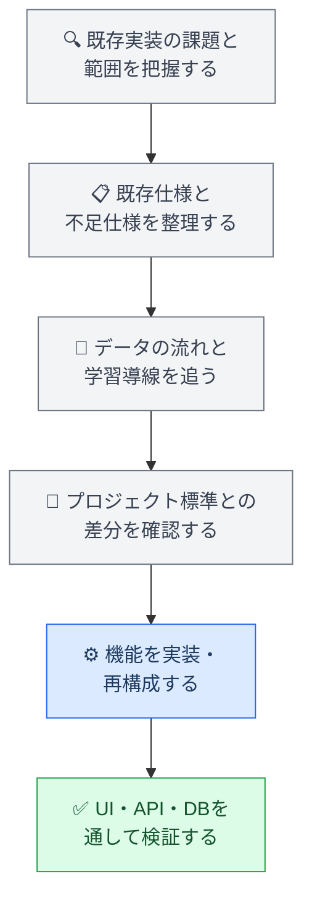
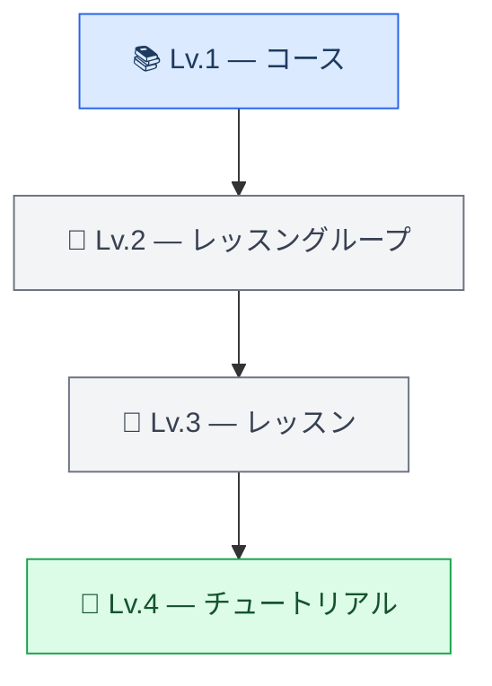
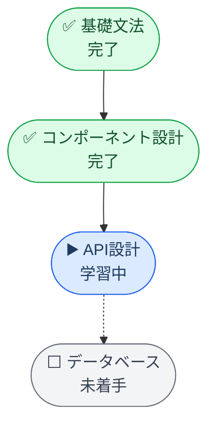
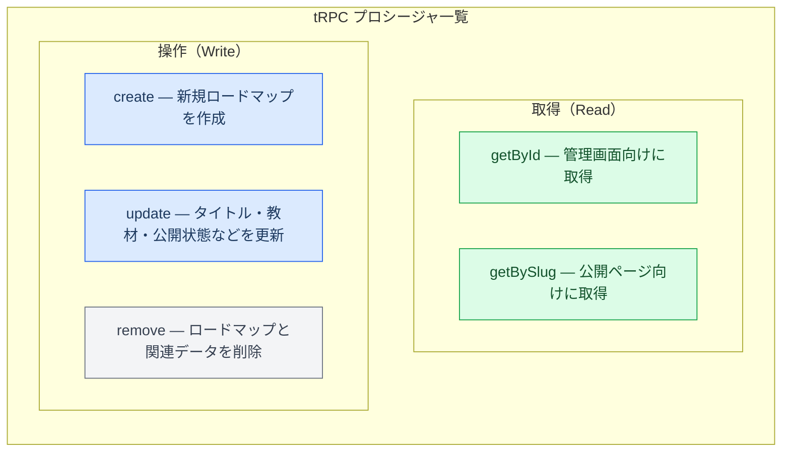

:::message
この記事はまだ書きかけの段階です。今後、実装内容や背景を加筆しながら改善していく予定です。内容に誤りや分かりにくい点がありましたら、ご指摘いただけるとありがたいです。
:::

## はじめに

教育系Webサービスで、学習者個人や教材を導入している組織ごとに、最適化されたカリキュラムに沿った学習経路を作成できる「カスタム学習ロードマップ機能」の開発を担当しました。

管理画面でロードマップを作成・編集し、教材を選択・並び替え・公開します。学習者向けページでは、ロードマップに沿った教材、学習順序、進捗を確認できます。

この機能は、CMS、学習者向けUI、API、データベース、公開状態、進捗計算、既存の学習導線まで複数の領域にまたがっていました。また、設計・実装上の課題を抱えたまま前任者が離れた状態から引き継ぎ、プロジェクト標準に合わせて再構成する必要もありました。

:::message
この記事では、守秘義務に配慮してプロジェクト名、内部URL、Issue・PR番号、具体的なモデル名や変数名を一般化しています。コードは実務コードそのものではなく、考え方を説明するためのサンプルです。
:::

## 1. なぜカスタムロードマップが必要だったのか

固定されたコース構成だけでは、学習者個人や、教材を導入している組織ごとに最適化されたカリキュラムに合わせて、教材を組み替えることが難しいという課題がありました。

例えば、次のような要件があります。

- 学習者の経験や目標に応じて学習内容を変えたい
- 組織ごとに必修にしたい教材が異なる
- 初級・中級・上級で学習順序を変えたい
- 特定のレッスンだけを組み合わせたい
- 組織独自のカリキュラムに沿って教材を公開したい
- 受講者に推奨する学習経路を別に定義したい

そこで、既存教材を再利用しながら、学習者個人や教材を導入している組織が、それぞれのカリキュラムに合わせた学習ロードマップを作成・公開できる仕組みを整備しました。

## 2. 設計・実装上の課題を抱えた状態からの引き継ぎ

前任者が作成していたのは、ロードマップCRUDの一部、新規作成画面、作成したサンプルロードマップを学習者向けページに表示する処理まででした。

一方で、設計段階からデータの責務や公開状態の扱いが十分に整理されておらず、既存プロジェクトのUI・API・設計標準からもずれていました。ロードマップを作成して表示する最小限の流れは存在していましたが、プロダクトとして運用するには、次の機能と設計の見直しが必要でした。

- CRUDの完成
- 教材の選択・解除・並び替え
- 公開・非公開制御
- 学習者向け進捗表示
- ロードマップ内の学習ナビゲーション
- 既存コースとの進捗計算の整合性
- UI・API・設計のプロジェクト標準への統一

既存コードをそのまま継ぎ足すのではなく、前任者の実装意図、既存データ構造、既存の学習導線を確認したうえで、利用できる部分と作り直す部分を整理しました。



## 3. プロジェクト標準への適合

引き継いだ実装には、既存プロジェクトで標準としているUIや設計方針と異なる部分がありました。機能を動かすだけでなく、既存機能との一貫性を保つため、以下も合わせて修正しました。

- UIコンポーネント、フォーム、モーダル、アコーディオンの統一
- ローディング・エラー・空状態の表示統一
- API・サービス・リポジトリの責務整理
- 権限・公開状態を考慮した取得経路の整理
- キャッシュ無効化と再取得タイミングの調整
- App Router、Server Component、Client Componentの役割整理

さらに、プロジェクトの技術方針変更に合わせて、APIをFrourioからtRPCへ、UIをChakra UIからMantine UIへ移行しました。

## 4. CMS管理画面

### 4.1 ロードマップのCRUDと公開制御

管理者がロードマップを作成・取得・更新・削除できるようにしました。管理対象はタイトル、説明、公開状態、slug、選択教材、教材の順序です。

作成中のロードマップは非公開で保持し、教材構成を確認してから公開できます。公開状態は画面上だけでなく、学習者向けAPIやURL直接アクセスでも制御しました。

### 4.2 階層的な教材選択

コースやレッスングループを階層的に表示し、コース単位・レッスングループ単位で教材を選択できるようにしました。



### 4.3 選択済み教材の並び替え

選択した教材はドラッグ＆ドロップで並び替えられるようにしました。画面上の一時的な順序と保存済みの順序を分け、保存時に最終的な順序をAPIへ送信します。

```ts
const orderedItems = items.map((item, index) => ({
  id: item.id,
  order: index
}))

await saveOrder(orderedItems)
```

## 5. 学習者向けページと進捗表示

学習者向けページでは、サンプルロードマップを単純に表示する状態から、ログインユーザーが実際の学習経路として利用できるページへ拡張しました。

ロードマップの概要、教材、学習順序、完了状態、進捗を表示し、進捗は垂直タイムラインで可視化しました。



## 6. コース経由とロードマップ経由の整合性

同じレッスンをコース経由とロードマップ経由で開く場合に、進捗率や次の遷移先が異なると不整合が起きます。そこで、進捗計算とナビゲーションを分けて設計しました。

### 6.1 進捗率の算出方式を共通化

ロードマップ専用の別ロジックを作らず、既存コースと同じ進捗計算処理を利用しました。

```ts
const achievementRatio = calculateCourseAchievement(
  roadMapLessonsWithProgress.map(({ lesson }) => lesson)
)
```

同じ算出関数を使うことで、学習経路によって進捗率の基準がずれないようにしました。

### 6.2 URLでロードマップの文脈を維持

ロードマップからレッスンやチュートリアルへ移動した後も学習経路を維持できるよう、URLにクエリパラメータを付与しました。

```text
/lessons/{lessonId}?from=roadmap&roadmapId={roadmapId}
```

この情報を次の画面・操作へ引き継ぐことで、パンくず、戻る導線、前後レッスン、次のチュートリアルやチャレンジでもロードマップの文脈を維持しました。

### 6.3 ロードマップ内の前後レッスン

`from=roadmap` と `roadmapId` がある場合は、ロードマップ内の前後関係を取得するAPIを利用します。通常のコース順でロードマップ外のレッスンへ遷移することを防ぎ、取得に失敗した場合はコース側へフォールバックします。

## 7. tRPCとZodによるAPI設計

### 7.1 型安全なCRUD

tRPCを利用し、ロードマップの作成・取得・更新・削除を型安全なプロシージャとして整理しました。



### 7.2 Zodによる入力バリデーション

フロントエンドだけでなく、サーバー側でもタイトル、説明、教材選択、公開状態などを検証しました。

```ts
const RoadmapInput = z.object({
  title: z.string().trim().min(1),
  description: z.string().optional(),
  lessonGroupIds: z.array(z.string()).default([]),
  isPublished: z.boolean()
})
```

## 8. データ整合性・DB設計・キャッシュ

### 8.1 slug・トランザクション・カスケード削除

| 項目 | 内容 |
|---|---|
| slug | ロードマップのURLに使うslugを自動生成し、既存slugとの重複チェックを実施 |
| トランザクション | ロードマップ本体・教材の関連・並び順を1トランザクションで更新し、途中失敗時の部分保存を防止 |
| カスケード削除 | ロードマップ削除時に教材との関連データも合わせて削除 |

### 8.2 キャッシュと表示パフォーマンス

管理画面は更新操作の即時反映、学習者向けページは表示速度と進捗の最新性を優先し、画面ごとにデータ取得とキャッシュの扱いを見直しました。教材完了後に古い進捗が残らないよう、再取得とキャッシュ無効化のタイミングを調整しています。

## 10. テスト工程

CMS・公開範囲・進捗計算・既存コースとの整合性・学習者向け遷移を、スキーマ・API・画面・データの各レイヤーで段階的に確認しました。

| 確認レイヤー | 主な観点 |
|---|---|
| スキーマ・型・静的チェック | Zodバリデーション、tRPC入出力型整合、TypeScript/Biome静的解析、SC/CC境界 |
| API・権限・公開範囲 | CMS側の閲覧・編集権限、一般ユーザーへの非公開データ非露出、不正IDのエラー処理 |
| CMS・学習者向け画面 | CRUD操作・教材選択・並び替え・公開切り替え、loading/エラー通知、進捗表示・タイムライン |
| 進捗・ナビゲーション・キャッシュ | コースとロードマップ間の進捗率整合、`from=roadmap` 引き継ぎ、前後レッスン、フォールバック、キャッシュ更新 |
| データ整合性・コードレビュー | 並び順・関連レコード・slug一意性・トランザクション、コードレビュー指摘の修正と別課題整理 |

## 11. この開発で担当した技術領域

| 領域 | 内容 |
|---|---|
| **Frontend** | React / TypeScript、Mantine UI、CMS管理画面、階層型教材選択、D&D並び替え、垂直タイムライン進捗表示、URLクエリによる学習経路維持、コース/ロードマップ順のナビゲーション切り替え |
| **Backend / API** | tRPC CRUD API、Zodバリデーション、教材選択・並び順更新、slug生成・重複チェック、公開状態制御、ロードマップ内前後レッスン取得、進捗率ロジック再利用 |
| **Database** | 教材関連管理、並び順の永続化、トランザクション、カスケード削除、slug一意性確保、既存進捗データとの整合 |
| **Migration** | 課題機能の引き継ぎと仕様整理、Frourio→tRPC移行、Chakra UI→Mantine移行、プロジェクト標準への統一、キャッシュ設計の見直し |

## 12. まとめ

前任者が設計・実装上の課題を抱えたまま残していたロードマップの作成・サンプル表示機能を引き継ぎ、学習者個人や教材を導入している組織ごとのカリキュラムに合わせた、管理画面から学習者向けページまでの機能として再構成しました。

主な取り組みは次の通りです。

- 不足していた教材選択・並び替え・公開制御・進捗・遷移を追加
- 既存プロジェクトのUI・API・設計標準とのずれを修正
- FrourioからtRPCへ、Chakra UIからMantine UIへ移行
- コースとロードマップで進捗率の算出方式を統一
- `from=roadmap` と `roadmapId` で学習経路の文脈を維持
- ロードマップ内の前後関係に基づくナビゲーションを実装
- Zod、slug重複チェック、トランザクション、カスケード削除を整備
- CMS操作、権限、公開範囲、画面遷移、進捗更新、キャッシュ、データ整合性を段階的に検証

機能の実装はマージ済みで、他の関連機能と順次統合しながら、段階的に本番環境へ反映される予定です。一部のUI/UX仕様については、プロダクト全体との整合性を踏まえて継続的に改善しています。

この開発を通じて、設計・実装上の課題を抱えた既存機能を読み解き、プロジェクト標準へ合わせながら、フロントエンド、API、DB、データ整合性、キャッシュ、学習導線、テスト工程までを一貫して設計する経験を得ました。
