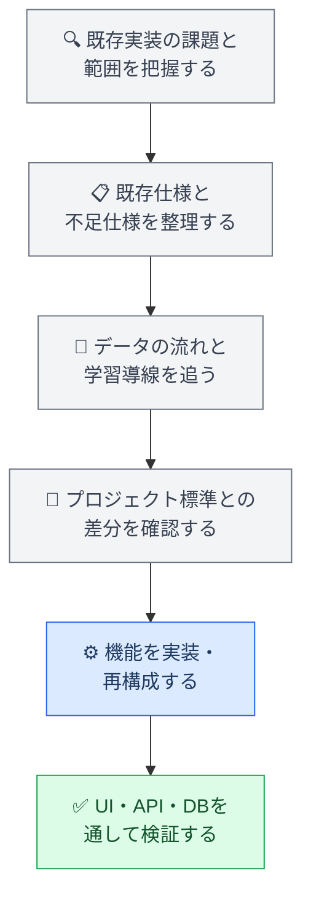
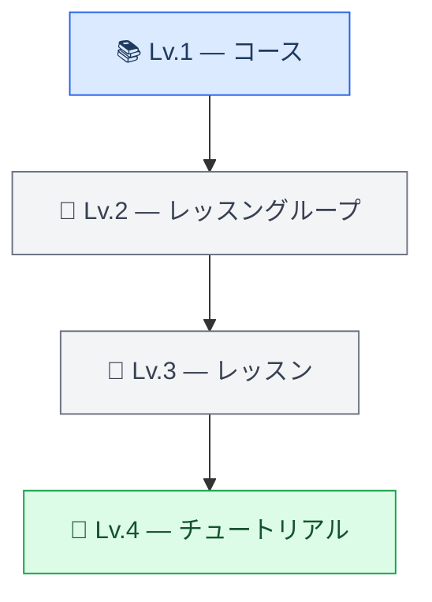
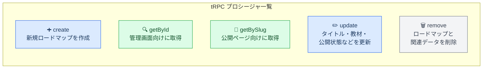

:::message
この記事はまだ書きかけの段階です。今後、実装内容や背景を加筆しながら改善していく予定です。内容に誤りや分かりにくい点がありましたら、ご指摘いただけるとありがたいです。
:::

## はじめに

教育系Webサービスで、学習者個人や教材を導入している組織ごとに、最適化されたカリキュラムに沿った学習経路を作成できる「カスタム学習ロードマップ機能」の開発を担当しました。

管理画面でロードマップを作成・編集し、教材を選択・並び替え・公開します。学習者向けページでは、ロードマップに沿った教材、学習順序、進捗を確認できます。

この機能は、CMS、学習者向けUI、API、データベース、公開状態、進捗計算、既存の学習導線まで複数の領域にまたがっていました。また、設計・実装上の課題を抱えたまま前任者が離れた状態から引き継ぎ、プロジェクト標準に合わせて再構成する必要もありました。

:::message
この記事では、守秘義務に配慮してプロジェクト名、内部URL、Issue・PR番号、具体的なモデル名や変数名を一般化しています。コードは実務コードそのものではなく、考え方を説明するためのサンプルです。
:::

## 1. なぜカスタムロードマップが必要だったのか

固定されたコース構成だけでは、学習者個人や、教材を導入している組織ごとに最適化されたカリキュラムに合わせて、教材を組み替えることが難しいという課題がありました。

例えば、次のような要件があります。

- 学習者の経験や目標に応じて学習内容を変えたい
- 組織ごとに必修にしたい教材が異なる
- 初級・中級・上級で学習順序を変えたい
- 特定のレッスンだけを組み合わせたい
- 組織独自のカリキュラムに沿って教材を公開したい
- 受講者に推奨する学習経路を別に定義したい

そこで、既存教材を再利用しながら、学習者個人や教材を導入している組織が、それぞれのカリキュラムに合わせた学習ロードマップを作成・公開できる仕組みを整備しました。

## 2. 設計・実装上の課題を抱えた状態からの引き継ぎ

前任者が作成していたのは、ロードマップCRUDの一部、新規作成画面、作成したサンプルロードマップを学習者向けページに表示する処理まででした。

一方で、設計段階からデータの責務や公開状態の扱いが十分に整理されておらず、既存プロジェクトのUI・API・設計標準からもずれていました。ロードマップを作成して表示する最小限の流れは存在していましたが、プロダクトとして運用するには、次の機能と設計の見直しが必要でした。

- CRUDの完成
- 教材の選択・解除・並び替え
- 公開・非公開制御
- 学習者向け進捗表示
- ロードマップ内の学習ナビゲーション
- 既存コースとの進捗計算の整合性
- UI・API・設計のプロジェクト標準への統一

既存コードをそのまま継ぎ足すのではなく、前任者の実装意図、既存データ構造、既存の学習導線を確認したうえで、利用できる部分と作り直す部分を整理しました。



## 3. プロジェクト標準への適合

引き継いだ実装には、既存プロジェクトで標準としているUIや設計方針と異なる部分がありました。機能を動かすだけでなく、既存機能との一貫性を保つため、以下も合わせて修正しました。

- UIコンポーネント、フォーム、モーダル、アコーディオンの統一
- ローディング・エラー・空状態の表示統一
- API・サービス・リポジトリの責務整理
- 権限・公開状態を考慮した取得経路の整理
- キャッシュ無効化と再取得タイミングの調整
- App Router、Server Component、Client Componentの役割整理

さらに、プロジェクトの技術方針変更に合わせて、APIをFrourioからtRPCへ、UIをChakra UIからMantine UIへ移行しました。

## 4. CMS管理画面

### 4.1 ロードマップのCRUDと公開制御

管理者がロードマップを作成・取得・更新・削除できるようにしました。管理対象はタイトル、説明、公開状態、slug、選択教材、教材の順序です。

作成中のロードマップは非公開で保持し、教材構成を確認してから公開できます。公開状態は画面上だけでなく、学習者向けAPIやURL直接アクセスでも制御しました。

### 4.2 階層的な教材選択

コースやレッスングループを階層的に表示し、コース単位・レッスングループ単位で教材を選択できるようにしました。



### 4.3 選択済み教材の並び替え

選択した教材はドラッグ＆ドロップで並び替えられるようにしました。画面上の一時的な順序と保存済みの順序を分け、保存時に最終的な順序をAPIへ送信します。

```ts
const orderedItems = items.map((item, index) => ({
  id: item.id,
  order: index
}))

await saveOrder(orderedItems)
```

## 5. 学習者向けページと進捗表示

学習者向けページでは、サンプルロードマップを単純に表示する状態から、ログインユーザーが実際の学習経路として利用できるページへ拡張しました。

ロードマップの概要、教材、学習順序、完了状態、進捗を表示し、進捗は垂直タイムラインで可視化しました。


## 6. コース経由とロードマップ経由の整合性

同じレッスンをコース経由とロードマップ経由で開く場合に、進捗率や次の遷移先が異なると不整合が起きます。そこで、進捗計算とナビゲーションを分けて設計しました。

### 6.1 進捗率の算出方式を共通化

ロードマップ専用の別ロジックを作らず、既存コースと同じ進捗計算処理を利用しました。

```ts
const achievementRatio = calculateCourseAchievement(
  roadMapLessonsWithProgress.map(({ lesson }) => lesson)
)
```

同じ算出関数を使うことで、学習経路によって進捗率の基準がずれないようにしました。

### 6.2 URLでロードマップの文脈を維持

ロードマップからレッスンやチュートリアルへ移動した後も学習経路を維持できるよう、URLにクエリパラメータを付与しました。

```text
/lessons/{lessonId}?from=roadmap&roadmapId={roadmapId}
```

この情報を次の画面・操作へ引き継ぐことで、パンくず、戻る導線、前後レッスン、次のチュートリアルやチャレンジでもロードマップの文脈を維持しました。

### 6.3 ロードマップ内の前後レッスン

`from=roadmap` と `roadmapId` がある場合は、ロードマップ内の前後関係を取得するAPIを利用します。通常のコース順でロードマップ外のレッスンへ遷移することを防ぎ、取得に失敗した場合はコース側へフォールバックします。

## 7. tRPCとZodによるAPI設計

### 7.1 型安全なCRUD

tRPCを利用し、ロードマップの作成・取得・更新・削除を型安全なプロシージャとして整理しました。



### 7.2 Zodによる入力バリデーション

フロントエンドだけでなく、サーバー側でもタイトル、説明、教材選択、公開状態などを検証しました。

```ts
const RoadmapInput = z.object({
  title: z.string().trim().min(1),
  description: z.string().optional(),
  lessonGroupIds: z.array(z.string()).default([]),
  isPublished: z.boolean()
})
```

## 8. slug・トランザクション・関連データ

### 8.1 slugの自動生成と重複チェック

ロードマップのURLに利用するslugを自動生成し、既存slugとの重複を確認しました。

### 8.2 トランザクションによる整合性確保

ロードマップ本体、教材との関連、並び順をまとめて更新し、途中で失敗した場合に一部だけが保存されないようトランザクション内で扱いました。

### 8.3 削除時のカスケード

ロードマップ削除後に関連データだけが残らないよう、教材との関連データを含めた削除方針を整理しました。

## 9. キャッシュと表示パフォーマンス

管理画面は更新操作の反映速度、学習者向けページは表示速度と進捗の最新性が重要です。そのため、画面ごとにデータ取得とキャッシュの扱いを見直しました。

教材完了後にもロードマップの進捗が古いまま残らないよう、再取得やキャッシュ無効化のタイミングを調整しました。

## 10. テスト工程

CMS、公開範囲、進捗計算、既存コースとの整合性、学習者向けの遷移を、スキーマ・API・画面・データの各レイヤーで段階的に確認しました。

### 10.1 スキーマ・型・静的チェック

Zodスキーマによる作成・更新・削除入力、tRPCの入出力型、フロントエンドとバックエンド間の型整合性を確認しました。あわせて、TypeScriptやBiomeによる静的チェック、App RouterとServer/Client Componentの境界も確認しました。

### 10.2 API・権限・公開範囲

CMSユーザーが非公開ロードマップを確認・編集できること、一般ユーザーには非公開ロードマップや教材が返らないことを確認しました。公開ロードマップだけが一覧に表示され、存在しないIDや不正なIDでは適切なエラーになることも確認しています。

### 10.3 CMS・学習者向け画面

CMSでは、作成・編集・削除、教材の個別選択・一括選択・解除、並び替え、公開切り替えを確認しました。入力エラー、保存中のloading、APIエラー通知も確認しています。

学習者向けページでは、公開ロードマップの一覧・詳細表示、教材の順序、アコーディオン、進捗リング、タイムライン、ローディング、進捗取得失敗時の表示を確認しました。

### 10.4 進捗・ナビゲーション・キャッシュ

同じレッスンをコースページとロードマップページの両方から開き、進捗率の算出基準、`from=roadmap` / `roadmapId`の引き継ぎ、パンくず・戻る導線、ロードマップ内の前後レッスンを確認しました。

また、チャレンジ、クイズ、スキルコーディング、チュートリアルの完了や再挑戦後に、レッスン・コース・ロードマップの進捗が更新され、古いキャッシュが残らないことを確認しました。ナビゲーション取得に失敗した場合のフォールバックも確認しています。

### 10.5 データ整合性・コードレビュー

作成・更新・削除後に、教材の紐付け、並び順、関連レコード、slugの一意性、既存の進捗データへの影響を確認しました。更新・削除途中の失敗で中途半端な状態にならないことも確認しています。

進捗計算では、チャレンジ結果、クイズ、スキルコーディングの正解状態を含むケースを確認しました。また、コードレビューで指摘されたslug生成、UUID、トランザクション、型定義、エラーハンドリング、公開条件などを修正し、既存プロジェクト全体に関わる項目はTODOや別課題に整理しました。

## 11. この開発で担当した技術領域

### Frontend

- React / TypeScript
- Mantine UI
- CMS管理画面
- 階層型の教材選択
- ドラッグ＆ドロップ並び替え
- 公開・非公開表示
- 垂直タイムラインによる進捗表示
- ローディング・エラー・空状態
- URLクエリによる学習経路コンテキストの維持
- コース順とロードマップ順のナビゲーション切り替え

### Backend / API

- tRPC
- CRUD API
- Zodによる入力バリデーション
- 教材選択・解除・並び順更新
- slug生成・重複チェック
- 公開状態を考慮した取得
- ロードマップ内の前後レッスン取得
- コースと共通の進捗率計算ロジックの再利用

### Database / Data Integrity

- ロードマップと教材の関連管理
- 並び順の永続化
- トランザクション
- カスケード削除
- 一意性の確保
- 既存の学習進捗データとの整合性

### Migration / Maintainability

- 設計・実装上の課題を抱えた機能の引き継ぎ
- 既存仕様と不足仕様の整理
- FrourioからtRPCへの移行
- Chakra UIからMantine UIへの移行
- 既存プロジェクト標準へのUI・設計統一
- データ取得とキャッシュの見直し

## 12. まとめ

前任者が設計・実装上の課題を抱えたまま残していたロードマップの作成・サンプル表示機能を引き継ぎ、学習者個人や教材を導入している組織ごとのカリキュラムに合わせた、管理画面から学習者向けページまでの機能として再構成しました。

主な取り組みは次の通りです。

- 不足していた教材選択・並び替え・公開制御・進捗・遷移を追加
- 既存プロジェクトのUI・API・設計標準とのずれを修正
- FrourioからtRPCへ、Chakra UIからMantine UIへ移行
- コースとロードマップで進捗率の算出方式を統一
- `from=roadmap` と `roadmapId` で学習経路の文脈を維持
- ロードマップ内の前後関係に基づくナビゲーションを実装
- Zod、slug重複チェック、トランザクション、カスケード削除を整備
- CMS操作、権限、公開範囲、画面遷移、進捗更新、キャッシュ、データ整合性を段階的に検証

機能の実装はマージ済みで、他の関連機能と順次統合しながら、段階的に本番環境へ反映される予定です。一部のUI/UX仕様については、プロダクト全体との整合性を踏まえて継続的に改善しています。

この開発を通じて、設計・実装上の課題を抱えた既存機能を読み解き、プロジェクト標準へ合わせながら、フロントエンド、API、DB、データ整合性、キャッシュ、学習導線、テスト工程までを一貫して設計する経験を得ました。
